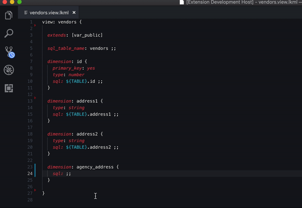

# Looker Visual Studio Code Extension
A Visual Studio Code extension meant to aid in the development of LookML -- [Looker's](https://looker.com/product/business-intelligence) custom markup language.
* [What is LookML?](https://docs.looker.com/data-modeling/learning-lookml/what-is-lookml)

## Features

### Implemented:
* Syntax highlighting with embedded SQL

* Storing and retrieval of Looker API credentials.
* Looker API Login.
* Parse workspace for field names
* Auto suggest view names

### Planned
* Use of API.  For example, running SQL queries directly from Visual Studio Code using [Run SQL Runner Query](https://docs.looker.com/reference/api-and-integration/api-reference/v3.1/sql-query#run_sql_runner_query).  SQL can be selected, sent to this endpoint, and the result saved to a temporary folder, where it could be viewed with a tabular data viewer like the VScode [Excel Viewer](https://marketplace.visualstudio.com/items?itemName=GrapeCity.gc-excelviewer) extension.
* LookML validation (with use of API endpoint [Validate Project](https://docs.looker.com/reference/api-and-integration/api-reference/v3.1/project#validate_project))
* Intellisense dimensions, measures, or filters from other view files.
* LookML and SQL auto-formatting.
* Add snippets (e.g., .dim, .mes, .fil, .par could create a default structure)

## Requirements

* Visual Studio Code

## Extension Settings

* None yet

## Known Issues

* None yet

## Release Notes

### 0.2
* Syntax highlighting with embedded SQL
* Storing and retrieval of Looker API credentials.
* Looker API Login.
* Parse workspace for field names