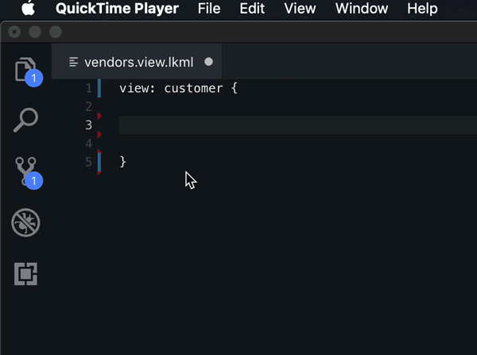

# Project State
The project's current state is not useful.  The LookML grammar is not working as one would expect.

I stopped working on this project about a year ago.  Primarily, due to time.  I've many ideas for useful tools, however, the whole project depends on a LookML language grammar, written in [TextMate](https://macromates.com/manual/en/language_grammars), using regex, in a VSCode formatted file.  In short, it is _extremely_ tedious and time intensive to get right.  So! I'll probably only continue work if many people feel it would be useful and I get a bit of spare time.  Or if any regex-TextMate-VSCode masters would like to help define the grammar.

# Looker Visual Studio Code Extension
A Visual Studio Code extension meant to aid in the development of LookML -- [Looker's](https://looker.com/product/business-intelligence) custom markup language.
* [What is LookML?](https://docs.looker.com/data-modeling/learning-lookml/what-is-lookml)


## Features

### Implemented:
* Syntax highlighting with embedded SQL
  

* Storing and retrieval of Looker API credentials.
* Auto suggest view and field name lookups.
  


#### Snippets
Useful templated code shortcuts.



`dim` + Tab
```
dimension: name {
    label: "Readable Dimension Name"
    description: "Description of the dimension"
    type: type
    sql: SQL string ;;
}
```
`mes` + Tab
```
measure: name {
    label: "Readable Dimension Name"
    description: "Description of the dimension"
    type: type
    sql: SQL string ;;
}
```
`fil` + Tab
```
filter: name {
    label: "Readable Filter Name"
    description: "Description of the filter"
    type: string
    suggest_dimension: id
    suggest_persist_for: "24 hours"
}
```

### Planned
* Use of API.  For example, running SQL queries directly from Visual Studio Code using [Run SQL Runner Query](https://docs.looker.com/reference/api-and-integration/api-reference/v3.1/sql-query#run_sql_runner_query).  SQL can be selected, sent to this endpoint, and the result saved to a temporary folder, where it could be viewed with a tabular data viewer like the VScode [Excel Viewer](https://marketplace.visualstudio.com/items?itemName=GrapeCity.gc-excelviewer) extension.
* LookML validation (with use of API endpoint [Validate Project](https://docs.looker.com/reference/api-and-integration/api-reference/v3.1/project#validate_project))
* LookML and SQL auto-formatting.
* Check if referencing a field from parallel view.
* Alphabetize `include:` statements.
* Auto include view files needed.


## Requirements

* Visual Studio Code

## Extension Settings

* None yet

## Known Issues

* None yet

## Release Notes

### 0.3
* Syntax highlighting with embedded SQL
* Storing and retrieval of Looker API credentials.
* Looker API Login.
* Parse workspace for field names
* Completion items for views and their relevant fields.
